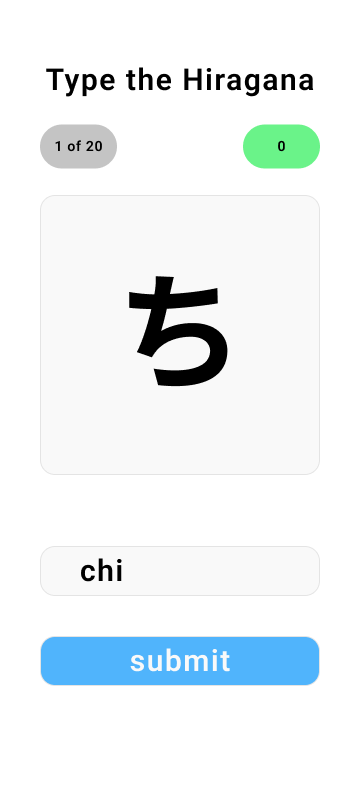
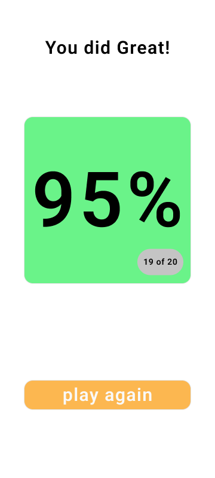
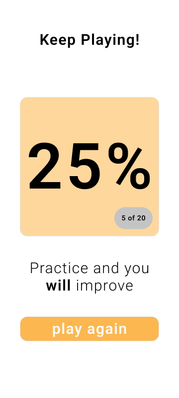

# Hiragana

Hiragana quiz game to help me practice recalling the characters.
I've been learning basics on Duolingo, but character practice
only has a few characters at a time and I'd like to practice
**recall** from the entire character set.

## Setup

Dependencies:

- [nodejs](https://nodejs.org/)
- [yarn](https://yarnpkg.com/)

Build:

```cmd
yarn install
```

Develop:

```cmd
yarn start
```

## UX Design

I'm learning how to use Figma so I've exported mockups of the
few screens. My intent is to make the UX for **mobile** so I can
practice on my phone when I have a few minutes.

The flow is:

1. Question
2. Results (2 flavors: Great and Improve)

### Question

The game should start immediately so I **don't waste time**
and have **progress** displayed between submissions. I haven't
thought of how to display correct/incorrect yet, but I think
some pop-up fade could speed up the game.



### Results (Great)

When the game is finished and I did well,
I want to feel success with the question display now
green with my percentile score since the higher number
will make me feel good.



### Results (Improve)

When the game is finished and I didn't do well,
say 80% or less, I don't want to feel bad but instead
get some motivation and encouragement to feel better.
I went with a soft orange for this as I find this more
neutral than more universal yellow or red.

The motivation here to encourage me rather than
remind me I did badly.


